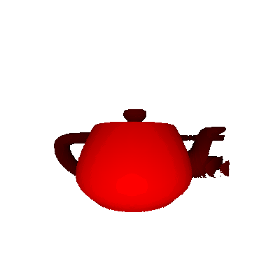

# Ray marching with grid-based signed distance functions
## Environment  
Python 3.6.3 on Anaconda 64bit  

## Features  
- [x] Grid-based SDFs renderer  
- [x] ParellelcComputing  
- [x] Compatible for other ray marching programs  
- [x] Pinhole camera implemented  
- [x] Depth (Model space) based linear interpolation for shading  
- [ ] Texture
- [ ] Lighting and shadow

## How to use  
* To use, run:  
~~~
python deploy.py --path filename
~~~
* My grid-based SDFs were generated from this project  
https://github.com/christopherbatty/SDFGen  

## Rendering results  
* Bunny from front 

* Bunny from top  

* Cube from rotated camera  

* Teapot    
  
